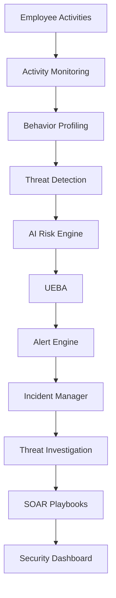

<div align="center">

# 🛡️ InsiderShield

## Enterprise AI-Powered Insider Threat Detection & Response Platform

### Monitor • Detect • Analyze • Investigate • Respond

An enterprise-grade cybersecurity platform that continuously monitors employee activities, detects insider threats using AI-driven behavioral intelligence, performs User & Entity Behavior Analytics (UEBA), manages incidents, and orchestrates automated SOAR response playbooks.


</div>

---

# 📖 Project Overview

**InsiderShield** is an enterprise cybersecurity platform designed to detect and respond to insider threats by analyzing employee behavior, monitoring system activities, calculating AI-powered risk scores, performing User & Entity Behavior Analytics (UEBA), managing investigations, and executing automated SOAR response playbooks.

The platform helps Security Operations Centers (SOCs) proactively identify malicious or suspicious insider behavior before it results in data breaches or security incidents.

---

# 🎯 Problem Statement

Organizations face increasing risks from insider threats, including:

- Unauthorized access
- Privilege abuse
- Data exfiltration
- Suspicious employee behavior
- Off-hours system access
- USB-based data theft
- Insider misuse of cloud resources

Traditional monitoring systems generate large volumes of alerts but often lack behavioral intelligence.

**InsiderShield addresses this challenge by combining AI-driven risk scoring, UEBA, investigation workflows, and automated response capabilities into a single enterprise platform.**

---

# 🚀 Key Features

## 🔐 Authentication & Access Control

- JWT Authentication
- Role-Based Access Control (RBAC)
- Secure Login
- Protected Routes
- User Profile Management

---

## 👥 Employee & Identity Management

- Employee Directory
- Employee Profiles
- Department Management
- Role Mapping
- Asset Association

---

## 📊 Activity Monitoring

- Login Monitoring
- Logout Tracking
- File Downloads
- File Uploads
- Application Usage
- USB Device Monitoring
- VPN Activity
- Network Events
- Privilege Changes

---

## 🧠 Behavioral Profiling Engine

- Login Pattern Analysis
- Work Pattern Monitoring
- Device Usage Analysis
- Resource Access Frequency
- Behavioral Baseline Generation
- Historical Trend Analysis

---

## 🚨 Threat Detection Engine

- Suspicious Login Detection
- Unauthorized Access Detection
- Data Exfiltration Detection
- Privilege Abuse Detection
- Behavioral Anomaly Detection
- Threat Severity Classification

---

## 🤖 AI Risk Scoring Engine

- Weighted Risk Calculation
- Historical Risk Tracking
- Explainable AI (XAI)
- Confidence Score
- Risk Recommendations
- Risk Trend Analysis

---

## 📈 User & Entity Behavior Analytics (UEBA)

### User Analytics

- Behavioral Baseline
- Peer Group Comparison
- Behavior Drift Detection
- Risk Prediction
- Outlier Detection

### Entity Analytics

- Device Monitoring
- Server Monitoring
- VPN Analytics
- USB Device Analytics
- Cloud Service Analytics
- IP Address Monitoring
- Browser Analytics

---

## 🔍 Threat Investigation

- Investigation Case Management
- Unified Timeline
- Evidence Collection
- User & Entity Correlation
- Analyst Workspace
- Investigation Notes
- Audit Logs
- Explainable AI Recommendations

---

## 🚨 Alert & Incident Management

- Security Alert Generation
- Alert Correlation
- Incident Management
- Incident Dashboard
- Incident Timeline
- Severity Classification
- Analyst Assignment

---

## ⚡ SOAR Response Playbooks

Automated Security Response Actions

- Suspend User Account
- Revoke Active Sessions
- Isolate Host
- Block USB Device
- Notify SOC Lead
- Incident Containment

---

## 📊 Security Dashboards

- Executive Dashboard
- SOC Dashboard
- Risk Dashboard
- UEBA Dashboard
- Investigation Dashboard
- Incident Dashboard

---

## 📑 Reports & Analytics

- Risk Analytics
- Department Risk Reports
- Security Reports
- Threat Reports
- Employee Reports
- Interactive Charts
- Historical Trends

---

# 🏛️ System Workflow

```text
Employee Activities
        │
        ▼
Activity Monitoring Engine
        │
        ▼
Behavioral Profiling Engine
        │
        ▼
Threat Detection Engine
        │
        ▼
AI Risk Scoring Engine
        │
        ▼
UEBA (User & Entity Analytics)
        │
        ▼
Alert Generation
        │
        ▼
Incident Correlation
        │
        ▼
Threat Investigation
        │
        ▼
SOAR Response Playbooks
        │
        ▼
SOC Dashboard
```

---

# 🏗️ System Architecture



---

# 🛠️ Technology Stack

| Layer | Technology |
|--------|------------|
| Frontend | React 19 + Vite |
| Styling | Tailwind CSS |
| Backend | FastAPI |
| Language | Python |
| Database | SQLite |
| ORM | SQLAlchemy |
| Validation | Pydantic |
| Authentication | JWT |
| Charts | Recharts |
| HTTP Client | Axios |
| Version Control | Git & GitHub |

---

# 📂 Project Structure

```text
InsiderShield

backend/

    app/

        api/

        models/

        repositories/

        schemas/

        services/

        database/

frontend/

    src/

        components/

        layouts/

        pages/

        services/

        hooks/

        assets/

docs/

screenshots/

README.md

LICENSE
```

---

# 📌 Completed Modules

| Module | Status |
|----------|--------|
| Authentication | ✅ |
| RBAC | ✅ |
| Employee Management | ✅ |
| Department Management | ✅ |
| Activity Monitoring | ✅ |
| Behavioral Profiling | ✅ |
| Threat Detection | ✅ |
| AI Risk Scoring | ✅ |
| Explainable AI | ✅ |
| UEBA | ✅ |
| Entity Analytics | ✅ |
| Threat Investigation | ✅ |
| Alert Management | ✅ |
| Incident Management | ✅ |
| SOAR Playbooks | ✅ |
| Dashboards | ✅ |
| Reports | ✅ |

---

# 🚀 Installation

## Clone Repository

```bash
git clone https://github.com/1at24cs054-rgb/InsiderShield.git
```

---

## Backend

```bash
cd backend

pip install -r requirements.txt

uvicorn app.main:app --reload
```

---

## Frontend

```bash
cd frontend

npm install

npm run dev
```

---

# 📡 API Documentation

FastAPI automatically generates Swagger documentation.

```
http://localhost:8000/docs
```

Redoc

```
http://localhost:8000/redoc
```

---

# 🧪 Testing

Run backend tests

```bash
python backend/test_risk_endpoints.py

python backend/test_ueba_endpoints.py

python backend/test_investigation_endpoints.py

python backend/test_incident_endpoints.py
```

Build frontend

```bash
npm run build
```

---

# 🔮 Future Enhancements

- Docker Deployment
- PostgreSQL Support
- Kafka Event Streaming
- Microsoft Sentinel Integration
- Splunk Integration
- SIEM Connectors
- Active Directory Integration
- Email Security Analytics
- MITRE ATT&CK Mapping
- AI Security Copilot
- Real-time WebSocket Alerts

---

# 👨‍💻 Author

**Dhanush**

Computer Science Engineering Student


---

<div align="center">

## 🛡️ InsiderShield

### Enterprise AI-Powered Insider Threat Detection & Response Platform

Built using **React • FastAPI • SQLAlchemy • SQLite • JWT • Tailwind CSS**

</div>
